# 🎶 Audio Plugin Portfolio

Welcome to my audio development portfolio.  
I am the founder and sole developer of an independent plugin company, with experience creating both **JUCE-based VST/AU plugins** and **Reason Rack Extensions (Jukebox framework)**.  

This portfolio contains **29 projects in total**:  
- **13 unreleased VST/AU plugins** (JUCE, C++)  
- **16 retired Reason Rack Extensions** (Jukebox, C++/Lua)  

Each repository includes:  
- Overview of the plugin  
- Feature list  
- Screenshots  
- User Manual (PDF) for JUCE plugins  
- Demo audio (where available)  

> ⚠️ Note: Source code is **not public**, as these products are intended for commercial release. This portfolio is for **showcase purposes only**.

---

## 📦 VST / AU Plugins (JUCE, C++)

| Plugin | Type | Status | Docs |
|--------|------|--------|------|
| [BlueRoom](https://github.com/JR2049/BlueRoom) | VST/AU | In development | [Manual](https://github.com/JR2049/BlueRoom/blob/main/BlueRoom.pdf) |
| [Distillery](https://github.com/JR2049/Distillery) | VST/AU | In development | [Manual](https://github.com/JR2049/Distillery/blob/main/Distillery.pdf) |
| [Spectre](https://github.com/JR2049/Spectre) | VST/AU | In development | [Manual](https://github.com/JR2049/Spectre/blob/main/Spectre.pdf) |
| [Elements G-Delay](https://github.com/JR2049/Elements-GDelay) | VST/AU | In development | [Manual](https://github.com/JR2049/Elements-GDelay/blob/main/Elements%20G-Delay.pdf) |
| [Elements S-Delay](https://github.com/JR2049/Elements-SDelay) | VST/AU | In development | [Manual](https://github.com/JR2049/Elements-SDelay/blob/main/Elements%20S-Delay.pdf) |
| [Elements Phaser](https://github.com/JR2049/Elements-Phaser) | VST/AU | In development | [Manual](https://github.com/JR2049/Elements-Phaser/blob/main/Elements%20Phaser.pdf) |
| [Elements Chorus](https://github.com/JR2049/Elements-Chorus) | VST/AU | In development | [Manual](https://github.com/JR2049/Elements-Chorus/blob/main/Elements%20Chorus.pdf) |
| [Elements Distort](https://github.com/JR2049/Elements-Distort) | VST/AU | In development | [Manual](https://github.com/JR2049/Elements-Distort/blob/main/Elements%20Distort.pdf) |
| [Elements Lo-Fi](https://github.com/JR2049/Elements-LoFi) | VST/AU | In development | [Manual](https://github.com/JR2049/Elements-LoFi/blob/main/Elements%20Lo-Fi.pdf) |
| [Elements Filter](https://github.com/JR2049/Elements-Filter) | VST/AU | In development | [Manual](https://github.com/JR2049/Elements-Filter/blob/main/Elements%20Filter.pdf) |
| [Relapse](https://github.com/JR2049/Relapse) | VST/AU | In development | [Manual](https://github.com/JR2049/Relapse/blob/main/Relapse.pdf) |
| [Mutagen](https://github.com/JR2049/Mutagen) | VST/AU | In development | [Manual](https://github.com/JR2049/Mutagen/blob/main/Mutagen.pdf) |
| [Pandemic](https://github.com/JR2049/Pandemic) | VST/AU | In development | [Manual](https://github.com/JR2049/Pandemic/blob/main/Pandemic.pdf) |

---

## 🎛️ Legacy Rack Extensions (Reason Studios)

Between 2013 and 2017, I developed and released **16 commercial Rack Extensions** for Reason Studios’ Rack Extension platform (Jukebox framework, C++/Lua).  

These products were sold through the Reason Studios shop for several years before being retired.  
While manuals and binaries are no longer available, they demonstrate my experience in:  

- Real-time DSP algorithm design  
- GUI development for audio plugins  
- Product release cycles (development, launch, support, retirement)  
- Cross-platform audio software development

## 📷 Screenshots of Rack Extensions

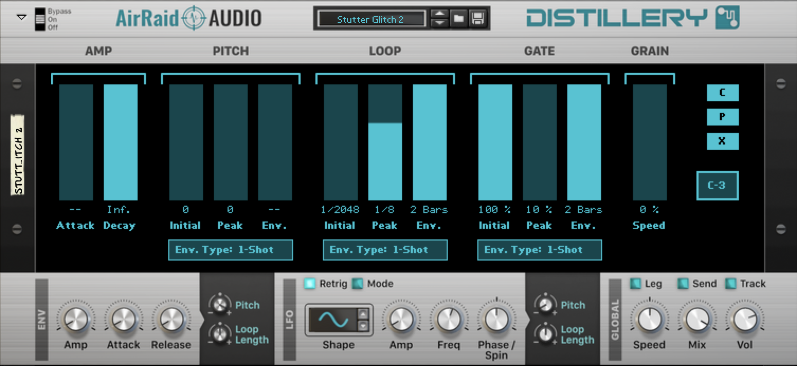
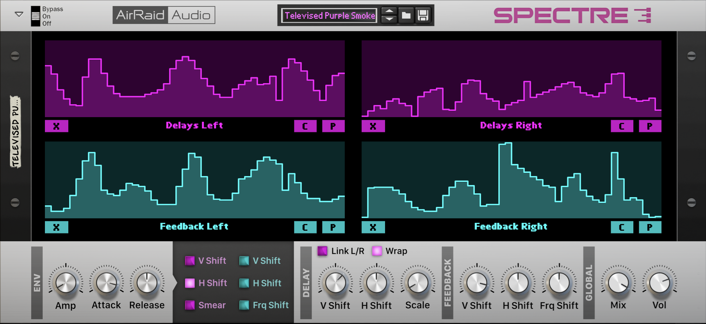
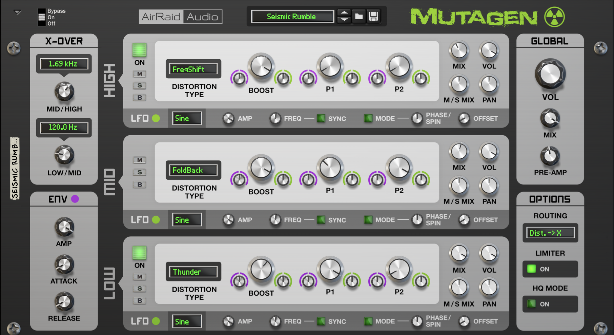
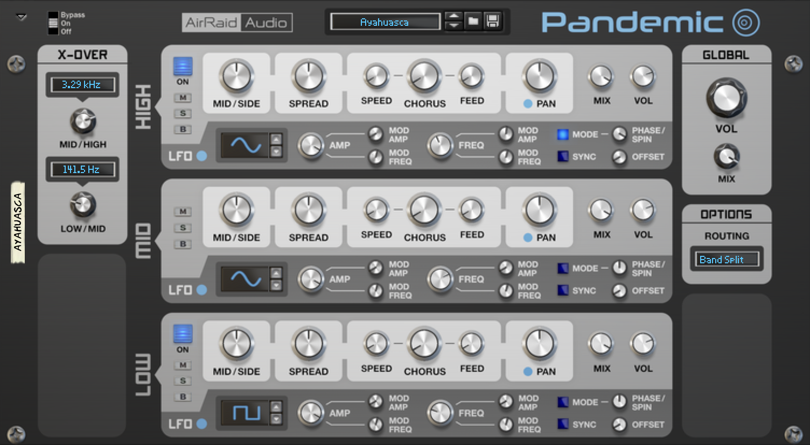
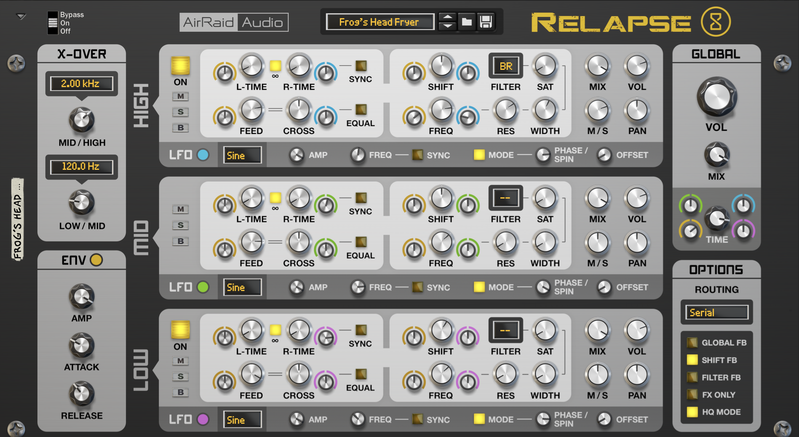
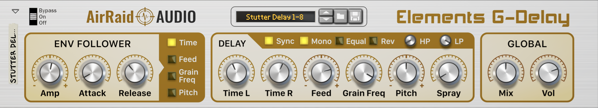
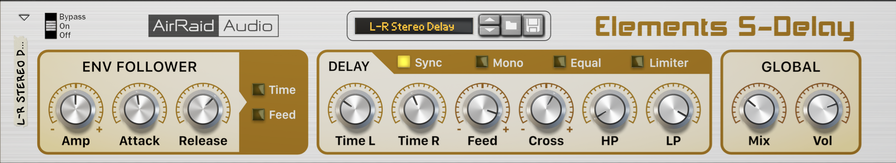
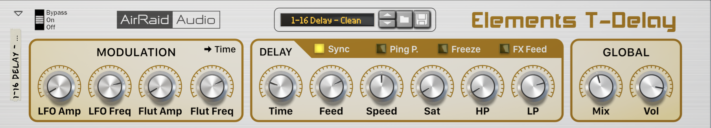
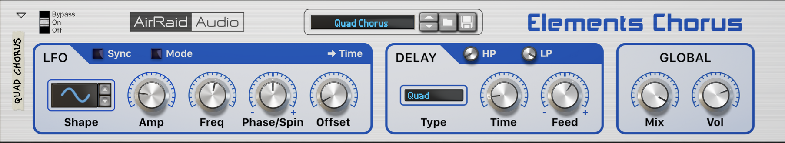
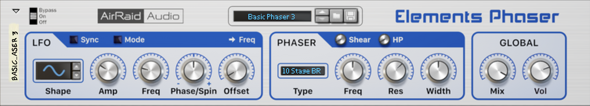
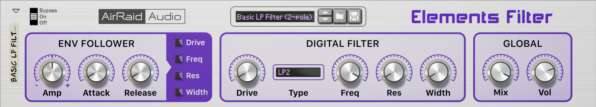
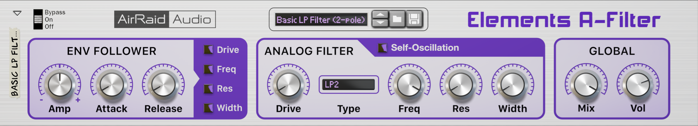
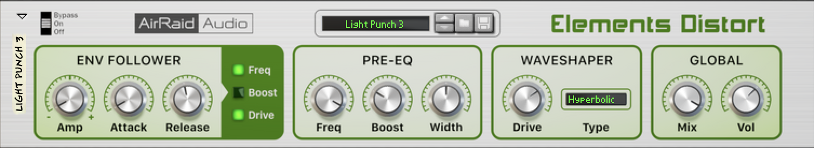
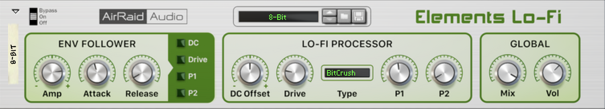
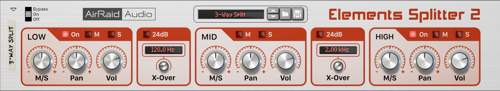
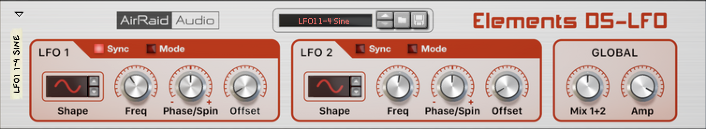

---

## 🛠️ Tech Stack

- **Languages:** C++, Python, Lua, JavaScript (basic), HTML, CSS  
- **Frameworks:** JUCE (C++), Jukebox (Reason Rack Extensions)  
- **Skills:** Audio DSP, GUI programming (2D/3D), product documentation, cross-platform builds  
- **Tools:** Git, Blender, Photoshop, Sketch, Pixelmator  

---
